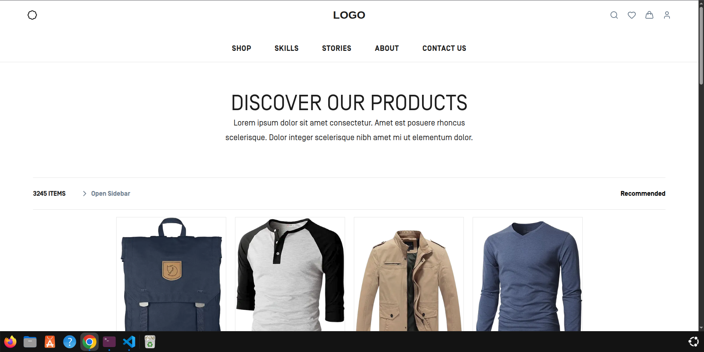
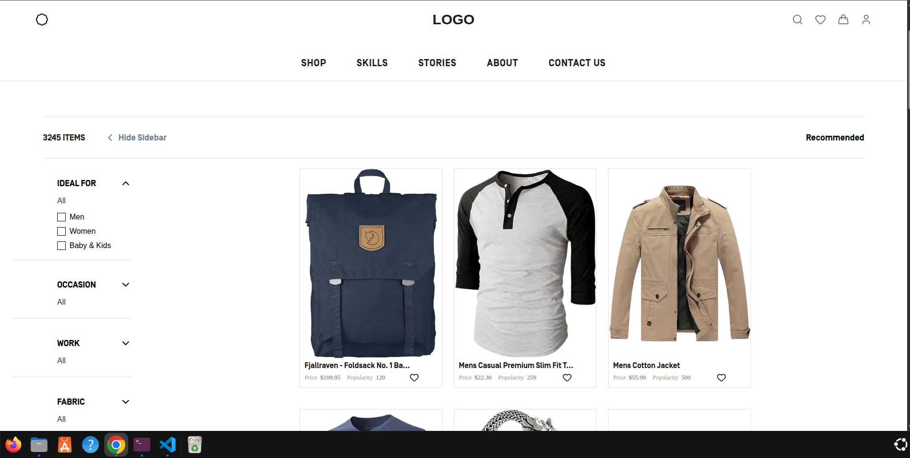
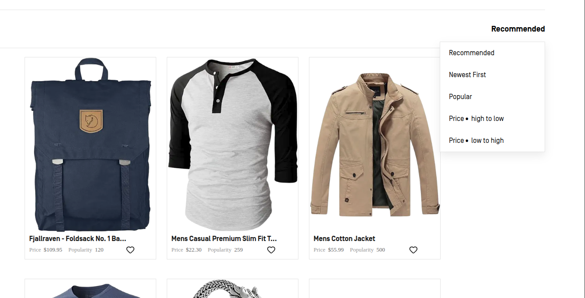
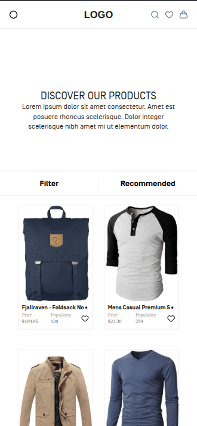

# Appscrip Product Listing

A responsive product listing page built as part of the Appscrip frontend assignment, based on the provided Figma design.

The page includes a responsive header, product listing, filters, sorting, and mobile layouts. Product data is fetched on the server and passed to client-side components for interaction.

## Live Demo

**Vercel:** https://appscrip-task-siddharth-dhodi-pncjayy3j.vercel.app/

**GitHub:** https://github.com/siddharthdhodi05/Appscrip-task-Siddharth-Dhodi

---

## Screenshots

### Desktop



### Sidebar



### Filters



### Mobile



---

## Features

* Responsive UI based on the provided Figma design
* Product data fetched from the Fake Store API
* Local fallback data when the API is unavailable
* Product sorting:

  * Recommended
  * Newest First
  * Popular
  * Price: High to Low
  * Price: Low to High
* Collapsible filter groups
* Responsive sidebar
* 3-column desktop grid with sidebar open
* 4-column desktop grid with sidebar closed
* 2-column mobile grid
* Responsive product cards
* Optimized product images
* Hover interactions

---

## Tech Stack

* **Next.js 16**
* **React**
* **TypeScript**
* **CSS Modules**
* **Lucide React**
* **Fake Store API**

The UI is built with plain CSS Modules. No Tailwind or Bootstrap is used.

---

## Project Structure

```text
src/
├── app/
│   ├── layout.tsx
│   ├── page.tsx
│   └── globals.css
│
├── components/
│   ├── Header/
│   ├── Hero/
│   ├── Products/
│   │   ├── ProductContent/
│   │   │   ├── ProductGrid/
│   │   │   │   └── ProductCard/
│   │   │   └── Sidebar/
│   │   ├── ProductToolbar/
│   │   └── ProductsClient.tsx
│   └── Footer/
│
└── lib/
    ├── product.ts
    ├── fallbackProducts.ts
    └── types.ts
```

The page is split into reusable sections such as Header, Hero, Products, Sidebar, ProductGrid, ProductCard, and Footer.

---

## Architecture

Product fetching is handled by a Server Component, while UI interactions are handled by a Client Component.

```text
page.tsx
   ↓
Products
   ↓
getProducts()
   ↓
Fake Store API
   ↓
ProductsClient
   ↓
Toolbar + Sidebar + ProductGrid
   ↓
ProductCard
```

`ProductsClient` manages sidebar visibility and sorting state and passes the required state and product data to the child components.

If the external API fails, the application uses local fallback product data instead.

---

## Sorting

The product list supports:

```text
Recommended
Newest First
Popular
Price: High to Low
Price: Low to High
```

Price sorting uses the product price, while Popular sorting uses the rating count provided by the API.

The Fake Store API does not provide creation dates, so `Newest First` preserves the available API order rather than assuming a date that does not exist.

---

## Responsive Layout

| Screen                  | Layout    |
| ----------------------- | --------- |
| Desktop + sidebar       | 3 columns |
| Desktop without sidebar | 4 columns |
| Mobile                  | 2 columns |

The product card dimensions are also adjusted for smaller screens to match the Figma design.

---

## Product Cards

Each product card displays:

* Product image
* Product title
* Price
* Popularity

Next.js `Image` is used for product images, with `object-fit: contain` to prevent product images from being cropped.

---

## Running Locally

Clone the repository:

```bash
git clone https://github.com/siddharthdhodi05/Appscrip-task-Siddharth-Dhodi.git
cd Appscrip-task-Siddharth-Dhodi
```

Install dependencies:

```bash
npm install
```

Start the development server:

```bash
npm run dev
```

Open `http://localhost:3000`.

For a production build:

```bash
npm run build
```

---

## Implementation Notes

* **Server Component** for product data fetching.
* **Client Component** only where state and interaction are required.
* **CSS Modules** for scoped component styling.
* **Fallback data** to keep the page functional if the external API is unavailable.
* **Reusable components** for product cards and filter groups.
* **Next.js Image** for optimized image handling.

---

## Author

**Siddharth Dhodi**

Full-Stack Developer

GitHub: https://github.com/siddharthdhodi05
